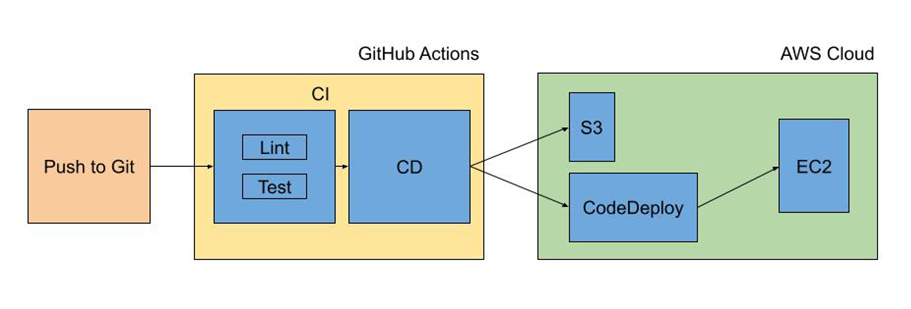

# Deployment

A short brief on deploying this project in an EC2 instance using GitHub Actions.

## CI/CD Pipeline Design



## Guide

[Github Actions for CI/CD with EC2, CodeDeploy and S3](https://medium.com/codemonday/github-actions-for-ci-cd-with-ec2-codedeploy-and-s3-e93e75bf1ce0)

## Guide++

This section covers the setup information that are not provided in the above guide.

Contents

- [Setup Redis](#setup-redis)
- [Setup Nginx](#setup-nginx)

### Setup Redis

1. Install redis in the EC2 instance

```
sudo apt update
sudo apt install redis-server
```

2. Update supervision interaction in `/etc/redis/redis.conf` file

```
. . .

# If you run Redis from upstart or systemd, Redis can interact with your
# supervision tree. Options:
#   supervised no      - no supervision interaction
#   supervised upstart - signal upstart by putting Redis into SIGSTOP mode
#   supervised systemd - signal systemd by writing READY=1 to $NOTIFY_SOCKET
#   supervised auto    - detect upstart or systemd method based on
#                        UPSTART_JOB or NOTIFY_SOCKET environment variables
# Note: these supervision methods only signal "process is ready."
#       They do not enable continuous liveness pings back to your supervisor.
supervised systemd

. . .
```

3. Restrict connections to localhost by uncommenting the following in `/etc/redis/redis.conf` file

```
bind 127.0.0.1 ::1
```

4. Restart redis service

```
sudo systemctl restart redis.service
```

### Setup Nginx

1. Install nginx in the EC2 instance

```
sudo apt install nginx
```

2. Add the following configuration for nginx

```
server {
  listen 80;
  server_name www.bookxchange.com;

  # deny access to admin endpoint
  location /api/v1/admin {
    deny all;
  }

  # backend server - nodejs
  location /api/v1/ {
    proxy_pass http://localhost:3000/api/v1/;
  }

  # frontend server - reactjs
  location / {
    root /home/ubuntu/bxc-web-app/build;
    try_files $uri /index.html;
  }
}
```
